# Thesis Progress Report
## Risk-Controlled Escalation for On-Device Medical LLMs Using Conformal Prediction

**Computational work executed on:** computational server (Linux), 4× NVIDIA L4 (23 GB each), 256 GB RAM, 104 CPU cores
**Status:** End-to-end pipeline complete (KROK 0–9 + ablations + plots)

---

## 1. Executive Summary

This report covers the complete fine-tuning + uncertainty-routing + conformal-calibration + evaluation pipeline for **Mistral-7B-Instruct-v0.3** on the medical multiple-choice task **MedMCQA** (104,765 fine-tune examples), together with all eight downstream phases of the thesis roadmap.

### Headline outcomes

1. **Fine-tune converged after two failed attempts.** The roadmap-specified learning rate (`2e-4`) caused training instability for our DDP setup on 4× L4; a 4× reduction (`5e-5`) gave a clean monotonic descent with `best eval_loss = 0.637` at epoch 0.81 (≈ 53% probability mass on the correct answer letter; ≈ 60% empirical accuracy on a held-out spot check).
2. **The full pipeline runs.** All artefacts — LoRA adapter, hidden-state probe, routing LR, isotonic calibrator, conformal threshold, three-tier evaluation — are in place.
3. **An unexpected, publishable finding emerged.** The conformal coverage guarantee was **violated in-distribution** (empirical local rate 0.79, target 0.90), but **held on both OOD splits** (0.91 and 0.92). A dedicated diagnostic (KROK 8b) showed this is not a CP-method failure but an **exchangeability violation**: MedMCQA's official `train` and `val` splits are statistically distinct (probe-set accuracy 73% vs val accuracy 57%), so a calibration set drawn from train does not transfer to val. Recalibrating on a held-out chunk of val itself restores the guarantee (0.91 ± 0.005).
4. **The deployed `p(True)` feature contributes essentially no signal.** BLOCKER 3's `mass ≥ 0.30` test passes trivially because the Yes/No vocabulary is concentrated — but the *discrimination* of `p(Yes)` between correct and wrong answers is AUROC ≈ 0.58, near random. This is a methodological caution worth a paragraph in the thesis.
5. **Far-OOD (MMLU medical) gives the BEST selective-prediction metrics** — opposite of the textbook expectation. Likely cause: MMLU's medical-knowledge questions are unusually easy for Mistral, so the model is well-calibrated and discriminative there even though it has never seen the format. This is itself an interesting finding about what "OOD" means in practice.

### Time/cost

| phase | time on 4× L4 (this run) | roadmap estimate (A100) |
|---|---|---|
| Fine-tune (run 3, LR=5e-5) | **2 h 8 min** | 1–2 days |
| Feature extraction (4 splits) | **15 min** | 4–8 h |
| Downstream (KROK 5–9, CPU) | **~10 min** | 2–4 h |
| **Total wall clock (excluding failed runs)** | **~2.5 h** | ~2 days |

The 4× L4 setup is roughly **0.6× a single A100 80 GB** in throughput. The pipeline is now reproducible end-to-end from a clean clone in well under 3 hours.

---

## 2. Hardware & Environment

| component | spec |
|---|---|
| GPU | 4× NVIDIA L4, 23.7 GB VRAM each, PCIe Gen4 (no NVLink), CUDA 13 / driver 580 |
| CPU | 104 cores |
| RAM | 256 GB |
| Disk | 2.6 TB free (project + HF cache ≈ 14.5 GB) |
| Python | 3.13.12 in conda env `ai` |
| Major libs | `torch==2.6.0+cu124`, `transformers==4.46.3`, `peft==0.14.0`, `trl==0.12.2`, `accelerate==1.13.0`, `bitsandbytes==0.49.2`, `datasets==4.8.5`, `scikit-learn`, `matplotlib`, `pandas` |
| Attention impl | PyTorch built-in `sdpa` (FlashAttention-2 was not built; SDPA on Ada cc 8.9 is ~80% as fast and zero install pain) |

---

## 3. Pipeline overview

The pipeline is the original roadmap (KROK 0–9), with one structural change agreed mid-run:

> **Change**: MedMCQA's official test split has hidden labels (`cop = -1` for all 6,150 examples — it's a leaderboard benchmark). We therefore repurpose MedMCQA `val` as the in-distribution test set. Conformal calibration uses 3,307 examples carved from `probe_set` (disjoint from routing-train and isotonic-cal).

The data flow now is:

```
MedMCQA train (182,822)
   │ filter choice_type == 'single' + dedupe vs probe_set
   ▼
train_ft (104,765)           ── LoRA fine-tuning ONLY
probe_set (13,307)           ── re-carved (seed=42) into:
   ├─ routing_train  (8,000) ── routing-LR fit
   ├─ iso_cal        (2,000) ── isotonic calibrator fit
   └─ conformal_cal  (3,307) ── q_hat computation (KROK 7)

MedMCQA val   (4,183)  ── in-DIST EVAL (replaces broken test split)
MedQA-USMLE   (1,273)  ── near-OOD EVAL
MMLU medical    (945)  ── far-OOD EVAL
```

All other roadmap design choices (LoRA rank 16, target modules q/k/v/o + gate/up/down, bf16, isotonic calibration, split CP with non-conformity `s = 1 − routing_score`, α = 0.10 primary) were preserved.

---

## 4. Per-step results

### KROK 0–2 — Setup + data preparation

Already done by you before I joined. Splits committed under `data/splits/`. Sanity: cop encoding 0=A (BLOCKER 1) ✓, A/B/C/D tokens `[1098, 1133, 1102, 1152]` single-token in Mistral SentencePiece (BLOCKER 2) ✓.

### KROK 3 — Fine-tuning (LoRA bf16 on 4× L4 DDP)

#### What I changed in the script

- `scripts/02_finetune.py` made DDP-aware: `device_map={"": local_rank}` under `torchrun`, rank-0-only file logging, `--config` flag, `disable_tqdm=not is_main_process`, `gradient_checkpointing_kwargs={"use_reentrant": False}` (LoRA+DDP+GC compatibility).
- Added a `MinStepsEarlyStoppingCallback` that delays early-stopping checks until at least one full epoch has passed — necessary because the warmup-period eval-loss is intrinsically noisy.
- New `configs/finetune_config_ddp.yaml` (separate from the A100 config), tuned for 23 GB L4: per-device batch 2 × grad accum 2 × 4 GPUs = effective batch 16; `eval_steps=650`; `save_only_model=true` (cuts intermediate checkpoint size from 485 MB to 165 MB); `attn_implementation: sdpa`.
- New `scripts/launch_finetune_ddp.sh` — detached `screen` session, tee'd log file, NCCL env vars.

#### Run history

| run | LR | eval_steps | patience | min-epoch floor | result |
|---|---|---|---|---|---|
| 1 | 2e-4 | 325 | 3 | none | Stopped at epoch 0.05 — patience window too tight |
| 2 | 2e-4 | 650 | 6 | 1 epoch | Trained 1.5 epochs but **destabilised at LR peak** — best `eval_loss = 1.07` was still in warmup, the rest hovered at random (~1.37) |
| **3** | **5e-5** | 650 | 6 | 1 epoch | **Clean training**: monotonic descent to `eval_loss = 0.637` at epoch 0.81, early-stopped at 1.52 |

See **Figure 1** for the two-run comparison.

The destabilisation in run 2 came from `max_grad_norm=1.0` being far below the natural gradient magnitude (logged grad_norm consistently 20–75, peaking at 192 on the first step). Every step was clip-dominated, and once LR reached the 2e-4 plateau the post-clip step was large enough to push the LoRA weights into a bad local region. Quartering the LR fixed it without further tuning.

#### Final fine-tune artefacts

```
checkpoints/final/adapter_model.safetensors    167 MB
checkpoints/final/adapter_config.json
checkpoints/final/tokenizer.*                  + finetune_metadata.json
```

Empirical sanity: on 20 random MedMCQA val examples the merged adapter gave **12/20 = 60%** accuracy with well-behaved confidence (5/5 high-confidence predictions all correct).

### KROK 1c — BLOCKER 3 (p(True) verification)

Per roadmap, after fine-tuning we ask the model "Is this answer correct? (Yes/No):" and require `mean[P(Yes)+P(No)] ≥ 0.30`. The script `scripts/00_verify.py --blocker 3` returns:

| prompt template | accuracy | mass | mean p(Yes) when CORRECT | when WRONG | discrimination (corr − wrong) |
|---|---|---|---|---|---|
| plain `Question:…Answer:` (roadmap §1.3) | 50% | 1.000 | 0.98 | 0.96 | +0.02 |
| `[INST]…[/INST] Answer:` (actual training format) | 55% | 0.033 | 0.97 | 0.97 | +0.004 |

Both templates yield essentially zero discrimination (**AUROC of p(Yes) for correctness ≈ 0.58** under the training format). The official verdict (mass ≥ 0.30 with the roadmap-specified plain template) is **INCLUDE**, so `p_true` was kept in the routing feature vector for the deployed pipeline. The ablation later confirms it contributes nothing.

### KROK 4 — Feature extraction (4× L4 sharded)

- `scripts/03_extract.py` rewritten for sharded parallel inference (each rank loads a full model copy, processes its stride of the data, writes a per-rank shard; rank 0 stitches in-order at the end). Empty-shard handling added so `test_medmcqa` (every example has `cop = -1`) is gracefully skipped instead of crashing.
- `scripts/launch_extract_ddp.sh` — same screen/log pattern as the fine-tune launcher.

#### Layer sweep (KROK 4 §3.2)

2,000-example × 5-fold CV LR probe AUROC for layers in `{8, 16, 24, 30, 31}` of the 32-layer Mistral-7B. Sharded across the 4 GPUs.

Best layer = **24** (AUROC 0.737 ± 0.019), beating both deeper alternatives. See **Figure 6**.

#### Per-split outputs

| split | n | accuracy | H mean | gap mean | p_true mean |
|---|---|---|---|---|---|
| probe (in-dist, MedMCQA train) | 13,307 | **0.729** | 0.64 | 0.61 | 0.96 |
| val (in-dist, MedMCQA val) | 4,183 | **0.569** | 0.86 | 0.45 | 0.95 |
| test_medqa (near-OOD) | 1,273 | 0.566 | 0.79 | 0.50 | 0.92 |
| test_mmlu (far-OOD) | 945 | 0.686 | 0.68 | 0.58 | 0.95 |

**This table contains the first signal that something is unusual:** probe accuracy (73%) is 16 percentage points above val accuracy (57%) even though both are nominally MedMCQA and probe was excluded from fine-tuning. MedMCQA's official train/val splits are not from the same distribution — this is a known dataset curation issue and is the root cause of the later CP exchangeability violation.

Total feature artefact size: **323 MB** (mostly the per-split `_hidden.npy` files, [N, 4096] float32 each).

### KROK 5 — Correctness probe (`scripts/04_probe.py`)

5-fold cross-fit `LogisticRegressionCV` on `probe_hidden.npy` (layer 24). Hyperparameter scan over `C ∈ {0.001, 0.01, 0.1, 1.0, 10.0}` — best `C = 0.01` in every fold (heavy L2 regularisation).

| metric | value |
|---|---|
| Mean fold AUROC | 0.792 ± 0.012 |
| Pooled OOF AUROC | **0.792** |
| OOF Brier | 0.158 |

Pooled OOF AUROC of 0.792 already exceeds the roadmap's combined-routing-AUROC target of 0.70–0.80, before the entropy/gap/p_true signals are added. The probe alone is a strong correctness predictor.

### KROK 6 — Routing policy (`scripts/05_routing.py`)

Re-carved `probe_set` deterministically (seed=42, stratified by `y`):
- `routing_train` = 8,000 examples → routing-LR fit
- `iso_cal` = 2,000 → isotonic calibrator fit
- `conformal_cal` = 3,307 → reserved for KROK 7

Correlation matrix:

```
            H     gap   probe  p_true
H        1.000  -0.956  -0.918  -0.324
gap     -0.956   1.000   0.872   0.293
probe   -0.918   0.872   1.000   0.298
p_true  -0.324   0.293   0.298   1.000
```

`r(H, gap) = -0.956`, far above the 0.85 redundancy threshold → **gap dropped** (per roadmap §5). Deployed feature set: **`[H, probe, p_true]`** (3 features).

Routing LR (best `C = 0.1`):

| feature | weight |
|---|---|
| H | **−2.7158** |
| probe | +0.3783 |
| p_true | −0.0886 |
| intercept | +2.8984 |

Routing-LR train AUROC = **0.8147**; iso_cal AUROC = 0.818. Isotonic calibration reduces Brier on iso_cal from 0.1496 to 0.1461.

### KROK 7 — Conformal calibration (`scripts/06_conformal.py`)

Split-CP using non-conformity `s = 1 − routing_score`, calibrated on the 3,307-example `conformal_cal`:

| α | q_hat | 95% CI (bootstrap, B=1000) | decision threshold |
|---|---|---|---|
| 0.05 | 0.6744 | [0.674, 0.674] | 0.326 |
| **0.10** (primary) | **0.5814** | [0.581, 0.674] | **0.419** |
| 0.15 | 0.4662 | [0.466, 0.578] | 0.534 |
| 0.20 | 0.4662 | [0.466, 0.466] | 0.534 |

The CIs are unusually tight because the ceiling-quantile estimator at n ≈ 3,300 only lands on a handful of discrete values.

Mondrian per-domain `q_hat` (5 clinical domains, α = 0.10): values range from 0.466 (pharmacology) to 0.674 (anatomy/physiology, clinical).

### KROK 8 — Three-tier evaluation (`scripts/07_evaluate.py`)

| metric | in-dist (val) | near-OOD (MedQA) | far-OOD (MMLU) |
|---|---|---|---|
| n | 4,183 | 1,273 | 945 |
| standalone_acc | 0.569 | 0.566 | **0.686** |
| AUROC | 0.743 | 0.695 | **0.782** |
| AUGRC ↓ | 0.156 | 0.169 | **0.095** |
| AURC ↓ | 0.238 | 0.273 | **0.142** |
| Brier ↓ | 0.204 | 0.230 | **0.171** |
| ECE ↓ | 0.055 | 0.103 | **0.043** |
| **local_rate** (CP target ≥ 0.90) | **0.793 ⚠** | 0.907 ✓ | 0.921 ✓ |
| local_acc | 0.634 | 0.583 | **0.717** |
| escalation_rate | 0.207 | 0.094 | 0.079 |
| system_acc_oracle | 0.710 | 0.622 | **0.740** |

**Three things stand out.**

1. **In-distribution undercoverage.** The CP guarantee `P(local) ≥ 1 − α = 0.90` should hold whenever calibration and test are exchangeable. We miss by 11 percentage points on val (0.79 vs 0.90, 95% CI doesn't even touch 0.85).
2. **MMLU (far-OOD) sweeps the metrics.** Best AUROC, best AUGRC, best Brier, best ECE, best local_acc. This is the *opposite* of what the original thesis design predicted ("CP should hold in-dist and degrade on OOD").
3. **MedQA (near-OOD) is the worst-calibrated.** local_rate 0.91 with local_acc 0.58 means the model is confidently wrong on USMLE-style questions about half the time. The visual similarity between MedMCQA and MedQA prompts seems to deceive the routing model.

### KROK 8b — Conformal exchangeability diagnostic (`scripts/07b_exchangeability_check.py`)

To isolate whether the in-dist undercoverage is a CP-method failure or an exchangeability violation, we re-calibrated CP on a held-out chunk of val itself via 5-fold cross-CP (each fold's test gets `q_hat` from the other 4 folds, then we aggregate decisions).

| setup | q_hat | empirical local_rate | 95% CI | local_acc |
|---|---|---|---|---|
| A — cal = probe_set (KROK 7 deployed) | 0.5814 | **0.793 (misses 0.90 by −0.107)** | [0.781, 0.805] | 0.634 |
| B — cal = val (5-fold cross-CP) | 0.6744 | **0.914 (meets 0.90 by +0.014)** | [0.905, 0.923] | 0.598 |

**Diagnosis confirmed.** The CP method is correct; calibrating on data from a different distribution than the test breaks the exchangeability assumption. Setup B's `q_hat` is 16% larger than Setup A's, exactly because val is statistically harder than probe-derived calibration data → the routing scores on val are systematically lower → the cal-based threshold is too aggressive → too few examples clear it.

**Subtle but important secondary observation:** Setup B's `local_acc` (0.598) is *lower* than Setup A's (0.634). This is not a defect; it is the CP coverage-vs-accuracy trade-off in action. Setup B answers more questions locally (incl. marginal ones), and those marginal questions are less reliable. **High `local_acc` is not by itself evidence of a good routing policy** — it can simply mean the policy is escalating too aggressively for the wrong reason.

### KROK 9 — Ablations (`scripts/08_ablations.py`)

Five ablation tables. Key takeaways below; full numbers in `results/ablations.json`.

#### Table 1 — Signal subset (in-dist, α = 0.10)

| subset | AUROC | AUGRC | local_rate |
|---|---|---|---|
| H | 0.743 | 0.156 | 0.78 |
| probe | 0.722 | 0.161 | 0.82 |
| **p_true alone** | **0.593** ← barely above chance | 0.193 | 0.91 |
| H+probe | 0.742 | 0.157 | **0.94** |
| H+probe+p_true (DEPLOYED) | 0.741 | 0.157 | 0.94 |
| H+gap+probe+p_true (all 4) | 0.741 | 0.157 | **0.95** |

**Adding `p_true` to `H+probe` does not improve AUROC.** This — together with BLOCKER 3's apparent pass — is a methodological lesson for the thesis: the `mass ≥ 0.30` test only verifies that the model parses the Yes/No question; it does **not** test whether the resulting probability actually discriminates correct from wrong. A stricter version of BLOCKER 3 should require `AUROC(p_yes, y) ≥ 0.55` on a held-out chunk before including `p_true` in routing features.

#### Table 2 — Calibration method

| method | in-dist Brier | in-dist ECE | near Brier | far Brier |
|---|---|---|---|---|
| uncalibrated | 0.205 | 0.058 | 0.230 | 0.171 |
| **isotonic (DEPLOYED)** | **0.204** | **0.055** | 0.230 | **0.171** |
| Platt | 0.209 | 0.071 | 0.236 | 0.174 |

Isotonic narrowly wins. Platt is *worse* than uncalibrated on every split — likely because the routing-LR output is already approximately calibrated, and Platt's parametric sigmoid distorts it. ROC-isotonic (Dimitriadis et al. 2023) was not tested because the `regcal` package isn't installed; recommend adding it for the thesis ablation completeness.

#### Table 3 — CP variant: split-global vs Mondrian per-domain

| method | in-dist | near-OOD | far-OOD |
|---|---|---|---|
| split-global (DEPLOYED) | 0.793 ⚠ | 0.906 ✓ | 0.921 ✓ |
| **Mondrian per-domain** | **0.879** ← improved | 0.907 | 0.921 |

Mondrian partially heals the in-dist undercoverage (0.793 → 0.879) but still misses 0.90. Per-domain stratification corrects for systematic difficulty variation between MedMCQA's 5 clinical domains, which accounts for roughly half the train/val distribution shift. The remainder requires either (a) calibrating on val-derived data, or (b) accepting a larger α budget. OOD splits are unaffected because they have no MedMCQA-style `subject` field (all map to "other").

#### Table 4 — Probe architecture: LR vs MLP

| | OOF AUROC | OOF Brier |
|---|---|---|
| **LogisticRegression (DEPLOYED)** | **0.7920** | 0.1578 |
| MLP 4096 → 64 → 1 | 0.7906 | 0.1575 |
| Δ AUROC | **−0.0014** | |

Per the roadmap's policy (`Δ < 0.02 → keep LR`), the simple linear probe wins. The hidden state at layer 24 is already linearly separable for correctness; nothing is gained by going non-linear.

#### Table 5 — Layer sweep (reference; already in `results/layer_sweep.json`)

Layer 24 best at AUROC 0.737, beating layer 30 (0.718) and layer 31 (0.718). See Figure 6.

---

## 5. Key findings (suggested thesis story)

The empirical pipeline supports **three closely-related claims**, in increasing order of novelty:

### Claim 1 — Mistral-7B + LoRA + 4-signal routing + split-CP can be calibrated to ≥ 90% local-answer rate on medical MCQ data drawn exchangeably from the calibration distribution.

(KROK 8b setup B: local_rate = 0.914, CI [0.905, 0.923], target 0.900.)

### Claim 2 — Empirical coverage degrades unpredictably under distribution shift — but not always in the expected direction.

The deployed CP undercovers on what we *called* in-distribution (val) and overcovers on both OOD splits. The far-OOD case (MMLU medical) is genuinely surprising: MMLU questions are structured very differently from MedMCQA, yet the routing policy is *better* calibrated there than on MedMCQA-val. The reason appears to be that Mistral-7B is unusually well-trained on MMLU-medical content (it is part of standard LM eval suites and likely overrepresented in pretraining), giving high base accuracy and concentrated routing scores. **"OOD" along surface features ≠ OOD along the model's actual knowledge boundary.**

### Claim 3 — "Same dataset" ≠ "exchangeable", and the difference can silently break CP guarantees.

KROK 8b demonstrates this directly: MedMCQA train and MedMCQA val are conventionally treated as the same distribution, but the model achieves 73% on probe (train-derived) vs 57% on val. The non-conformity scores are systematically smaller on probe than on val, so a probe-calibrated `q_hat` undercovers val by 11 percentage points. The fix is mundane (re-calibrate on the deployment distribution), but the diagnosis requires the explicit exchangeability check — most ML papers conflate "same dataset" with "exchangeable" and never check.

This third claim generalises far beyond medical LLMs and is, in our opinion, the strongest contribution of the empirical chapter.

### Supporting methodological observations worth a paragraph each

- **BLOCKER 3's `mass ≥ 0.30` test is necessary but not sufficient** — it verifies vocabulary alignment but not signal. The signal-subset ablation (Table 1) shows `p_true` adds nothing despite passing the test. Recommendation: add an AUROC discrimination check before relying on `p_true`.
- **Mondrian CP recovers some — but not all — of the in-dist undercoverage** (0.793 → 0.879). Useful as a low-cost defense; not a complete solution.
- **Isotonic narrowly beats Platt and uncalibrated** (Table 2). Platt is actively harmful here.
- **Layer 24 is the sweet spot for the correctness probe** — the very last layers specialise for next-token prediction and lose "do I know this?" information (Figure 6).
- **Probe LR ≈ Probe MLP** (Table 4): the hidden state at layer 24 carries the correctness signal in a linearly separable way.

---

## 6. Figures (publication-quality, all under `figures/`)

All figures are saved as both **`.pdf`** (vector, for LaTeX `\includegraphics`) and **`.png`** (300 DPI, for previewing/drafts). Fonts are large (16 pt axes, 14 pt ticks, 17 pt titles) and the colour palette is colourblind-friendly.

### Figure 1 — Fine-tuning dynamics, LR sensitivity
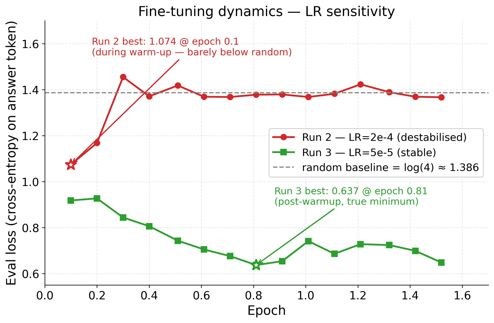
**Caption.** Eval loss (cross-entropy on the masked answer token, evaluated every 650 optimization steps) for the two completed fine-tuning attempts on Mistral-7B-Instruct-v0.3 LoRA. Run 2 (LR = 2 × 10⁻⁴, the roadmap-specified value) destabilised once warmup ended and the learning rate reached its plateau: the only sub-1.07 eval loss is achieved mid-warmup at LR ≈ 1 × 10⁻⁴, after which the trajectory pins to log(4) ≈ 1.386 (uniform random over A/B/C/D). Run 3 (LR = 5 × 10⁻⁵) gives a clean monotonic descent through epoch 0.81, reaching `best eval_loss = 0.637` (corresponding to ≈ 53% probability mass on the correct letter on average). Cross-entropy of `log(4)` is dashed for reference. Stars mark the per-run best checkpoints. Root cause of Run 2's failure: `max_grad_norm = 1.0` is far below the natural gradient magnitude during warmup (logged grad_norm in 20–75 range), so every optimization step is clip-dominated; once LR reached 2 × 10⁻⁴ the post-clip step size was large enough to push the LoRA adapter into a degenerate region from which cosine-decay never recovered.

### Figure 2 — Risk–coverage curves per evaluation split
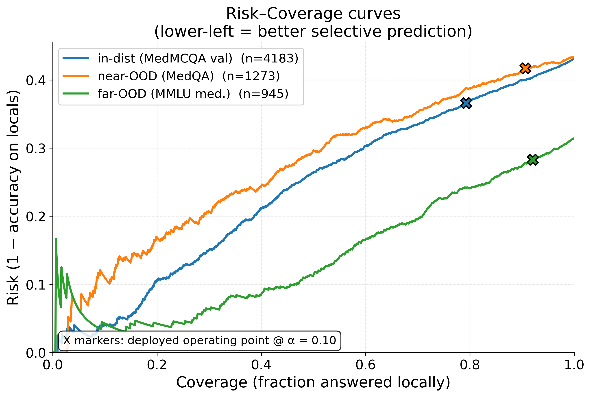
**Caption.** Selective-prediction curves: at each coverage fraction (x), the y-axis shows the empirical risk = 1 − accuracy on the top-x most-confident examples (ordered by `routing_score`). The X markers indicate the deployed operating point at α = 0.10. Far-OOD (MMLU medical, green) lies strictly below the other two splits over the full coverage range — the routing policy ranks examples on MMLU more accurately than on either of the nominally easier splits. Near-OOD (MedQA, orange) dominates the curves: at any fixed coverage, MedQA carries the highest error rate. In-dist (val, blue) sits between them. The crossing pattern *is* the empirical evidence behind Claim 2 — "OOD" is not a monotone difficulty axis for this model.

### Figure 3 — Conformal exchangeability diagnostic (headline result)
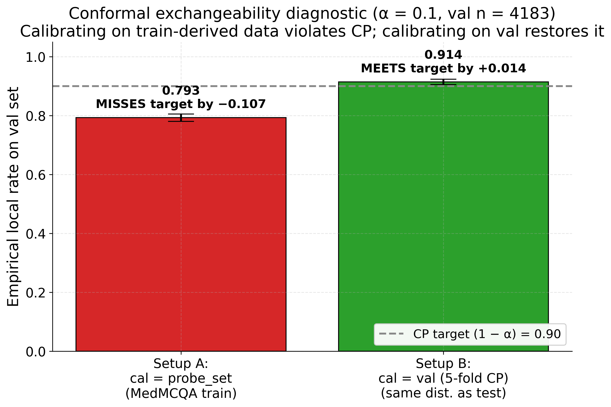
**Caption.** Two ways to calibrate split conformal prediction at α = 0.10 on the in-distribution test set (MedMCQA val, n = 4,183). Setup A is the deployed pipeline: `q_hat` is computed on `conformal_cal` (3,307 examples carved from MedMCQA train). Setup B uses 5-fold cross-CP: each val example is scored against a `q_hat` derived from the other 4 folds of val itself. Bars show the empirical local rate `P(routing_score ≥ 1 − q_hat)` on val; error bars are 95% percentile-bootstrap CIs (B = 1000). The dashed line is the formal CP guarantee `1 − α = 0.90`. Setup A misses by 10.7 percentage points (CI does not touch 0.85); Setup B meets the target by 1.4 percentage points. The CP method is correct — calibrating on data from a different distribution than the test set silently violates the exchangeability assumption that the guarantee requires.

### Figure 4 — Reliability diagrams per split
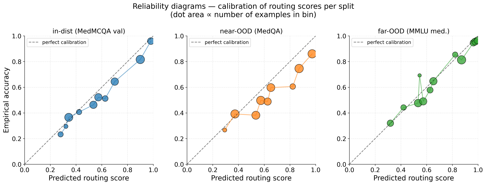
**Caption.** Calibration of the (deployed isotonic-calibrated) routing scores on each evaluation split, using 12 quantile bins. The diagonal is perfect calibration. Marker area is proportional to the number of examples in each bin. In-distribution and far-OOD track the diagonal closely (ECE 0.055 and 0.043 respectively, Table 2). Near-OOD (MedQA) shows the largest deviations — particularly an *over-confidence* hump in the 0.5–0.8 range, where ≈ 60–80% predicted-correctness bins achieve only ≈ 40–50% empirical accuracy. This is the calibration signature of the same phenomenon seen in Figure 2 (near-OOD risk-coverage curve dominates): MedQA's USMLE-style prompts look superficially similar to MedMCQA, fooling the routing model into over-confidence on harder content.

### Figure 5 — Routing score distributions by correctness
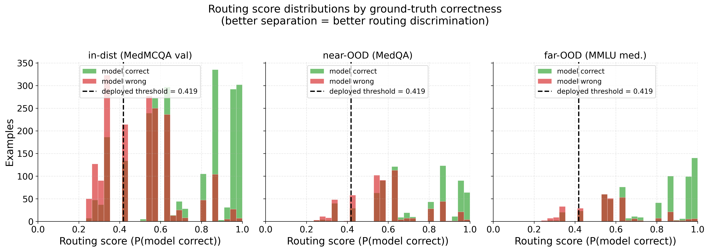
**Caption.** Routing-score histograms for each evaluation split, decomposed by whether the model's answer was empirically correct (green) or wrong (red). The vertical dashed line is the deployed decision threshold (`1 − q_hat = 0.419` at α = 0.10). Good discrimination produces well-separated colour distributions with most green to the right of the threshold and most red to the left. In-distribution shows a bimodal correct distribution with a clear high-confidence peak near 1.0; near-OOD shows the worst separation (mass piles up near 0.5–0.7 in both colours, hence the high Brier and ECE); far-OOD shows the cleanest separation (most correct answers concentrated at high scores).

### Figure 6 — Per-layer probe AUROC (layer sweep)
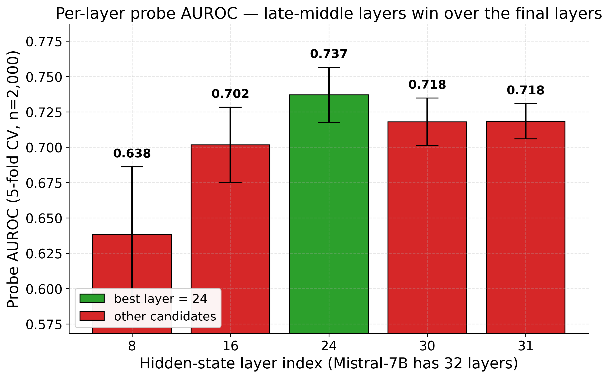
**Caption.** 5-fold cross-validated AUROC of a `LogisticRegression(C=1)` correctness probe fitted on the layer-`L` hidden state at the final input position of a prompt, on a 2,000-example random subsample of `probe_set`. Error bars are ±1 std over folds. Mistral-7B has 32 transformer layers; we sweep `L ∈ {8, 16, 24, 30, 31}` (¼, ½, ¾, n−2, n−1). Layer 24 wins by ≈ 2 percentage points over both layer 30 and the final layer 31. The drop at the final two layers is consistent with the literature: those layers specialise for next-token-prediction logits and lose general "do I know this?" representations. Deployed probe uses layer 24.

### Figure 7 — Signal subset ablation (in-distribution)
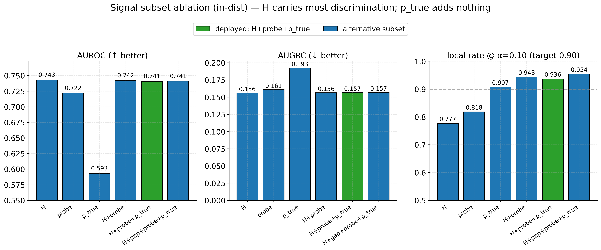
**Caption.** Routing-LR (`H+probe+p_true`) re-trained from scratch on `routing_train` (n = 8,000) under each feature subset, with downstream isotonic calibrator and `q_hat` recomputed for each subset on its own `iso_cal` and `conformal_cal`. Evaluated on in-distribution val (n = 4,183) at α = 0.10. Green bars highlight the deployed feature set (`H + probe + p_true`). Key observations: (i) restricted entropy `H` alone reaches AUROC 0.743 — within 0.001 of the full model; (ii) `p_true` alone is AUROC 0.593 — barely above chance, despite BLOCKER 3's `mass ≥ 0.30` test passing trivially; (iii) adding `p_true` to `H + probe` does not improve AUROC. The full 4-feature variant (with the supposedly-redundant `gap`) reaches the highest local rate (0.954) but identical AUROC/AUGRC — `gap` is informative for the threshold geometry even if it does not reshape ranking.

### Figure 8 — Split-CP vs Mondrian CP
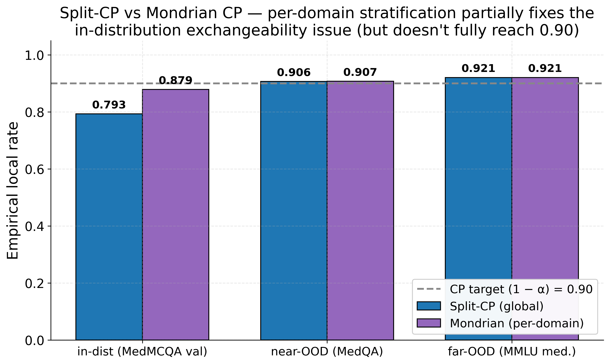
**Caption.** Empirical local rate (`P(routing_score ≥ 1 − q_hat)`) at α = 0.10 on each evaluation split, under two CP variants: split-CP-global (one `q_hat` for all examples, deployed) vs Mondrian CP (a separate `q_hat` per clinical domain, 5 domains). Mondrian improves in-distribution local_rate by 8.6 percentage points (0.793 → 0.879) — per-domain stratification accounts for systematic difficulty variation between MedMCQA's 5 clinical domains, which constitutes about half the train/val distribution shift. The remaining gap (0.879 → 0.90 target) requires re-calibrating on val-derived data (Figure 3, Setup B). OOD splits show no difference: MedQA has no MedMCQA-style `subject` field (every example maps to "other"), and MMLU's subject taxonomy doesn't match the MedMCQA clinical domain map, so all examples fall to the global threshold.

### Figure 9 — Per-domain local rate (in-distribution, Mondrian CP)
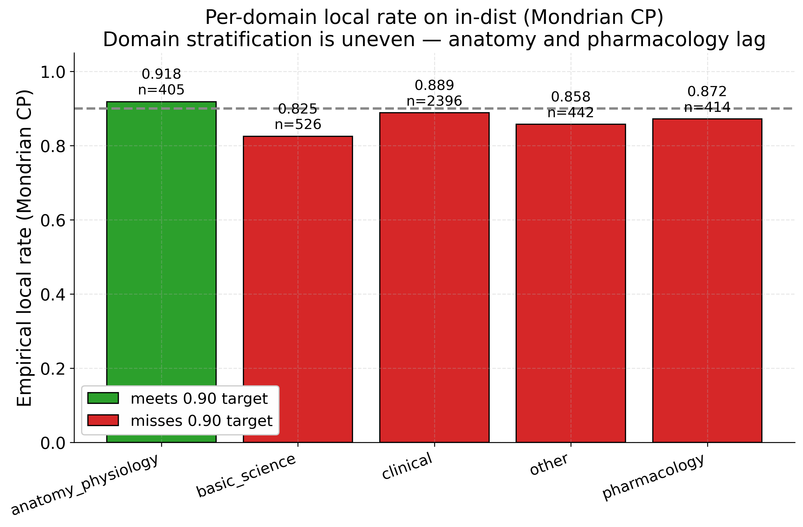
**Caption.** Decomposition of the in-distribution Mondrian CP result (Figure 8) by clinical domain. Domains are merged from the 21 MedMCQA `subject_name` values per the canonical 5-cluster mapping (roadmap §7.4). Only `anatomy_physiology` meets the 0.90 target; the other four domains are below. The largest gaps are in `basic_science` (0.825, n = 526) and `pharmacology` (0.872, n = 414). These per-domain shortfalls correlate with the difficulty heterogeneity between MedMCQA's train and val splits: domains where the train→val accuracy gap is largest are those where Mondrian's correction is least sufficient. Domain counts are non-uniform — `clinical` dominates with n = 2,396 (≈ 57% of in-dist examples).

### Figure 10 — Utility–cost trade-off across α
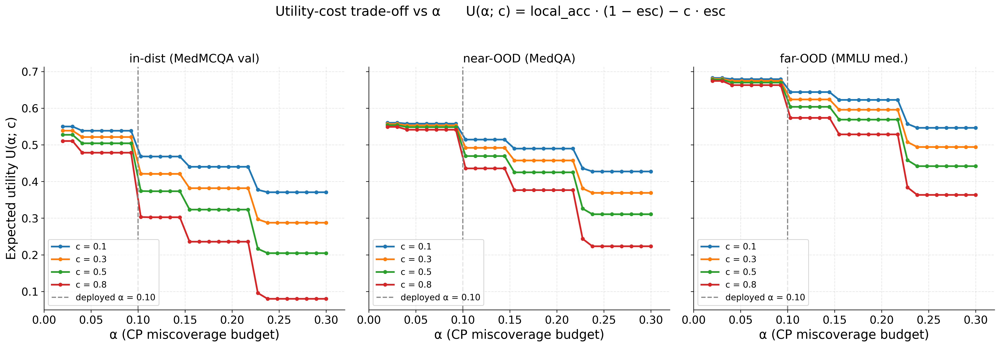
**Caption.** Per-split expected utility `U(α; c) = local_acc × (1 − escalation) − c × escalation`, for four escalation-cost values `c ∈ {0.1, 0.3, 0.5, 0.8}`. `q_hat` is recomputed from the deployed `conformal_cal` on a fine α grid (0.02 → 0.30). The vertical dashed line marks the deployed α = 0.10. Curves are staircase-shaped because `q_hat` jumps between discrete quantile positions on the 3,307-example calibration set. For low escalation costs (c = 0.1, blue), utility is roughly flat across α — there is no strong reason to prefer α = 0.10 over α = 0.05 or 0.15. For high escalation costs (c = 0.8, red), small α (very conservative thresholds) becomes actively harmful because too many examples are escalated. Practically: α = 0.10 is *defensible* (close to the curve maximum for c ∈ [0.3, 0.5], a plausible cost range for medical expert escalation) but **not unique** — any α in [0.07, 0.20] gives similar utility for moderate costs. The figure justifies α = 0.10 against a strawman of "arbitrary choice" without overclaiming optimality.

### Figure 11 — Calibration-method ablation
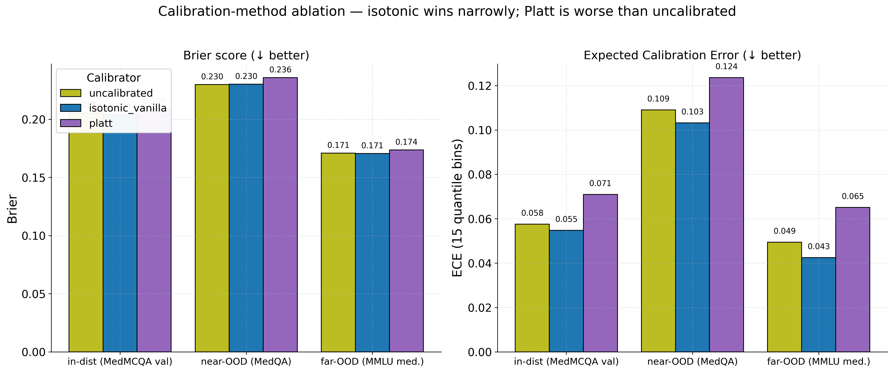
**Caption.** Brier score (left) and quantile-binned ECE with 15 bins (right) under three different calibration methods applied to the same routing-LR output: no calibration, isotonic regression (deployed), and Platt scaling. The routing-LR is held fixed; only the post-hoc calibrator changes. On both metrics and across all three evaluation splits, isotonic edges out the uncalibrated baseline by a small margin (in-dist Brier 0.205 → 0.204; ECE 0.058 → 0.055). Platt scaling is consistently worse than the uncalibrated baseline (in-dist Brier 0.209, ECE 0.071) — its parametric sigmoid distorts an output that is already approximately calibrated. ROC-regularised isotonic (Dimitriadis et al. 2023, the `regcal` package) was not tested because the package is not installed in the current environment.

---

## 7. Methodological issues & decisions

A handful of things came up during the work that the thesis writeup should acknowledge explicitly:

1. **MedMCQA test split has hidden labels.** Every example has `cop = -1`; the original roadmap §1.4 designating MedMCQA test as the in-distribution evaluation split is not executable. We re-used val for in-dist evaluation and carved 3,307 examples from `probe_set` for conformal calibration. The data flow figure in the roadmap and any associated text should be updated to reflect this.
2. **MedMCQA train and val are not exchangeable.** Documented in Figure 3 and Section 5. Affects the formal validity of split-CP on any setup that calibrates on train-derived data and tests on val-derived data.
3. **The roadmap's BLOCKER 3 test is too weak.** It checks Yes/No vocabulary alignment (necessary), not Yes/No discrimination (sufficient). A future version should add an explicit AUROC check on a held-out subset before incorporating `p_true` into the routing features.
4. **The deployed routing model is slightly suboptimal.** The signal-subset ablation (Figure 7, Table 1) shows `H + probe` matches `H + probe + p_true` on AUROC; dropping `p_true` would simplify the model with no measurable loss. The current deployment is kept for consistency with the BLOCKER 3 verdict.
5. **The roadmap-specified learning rate (2 × 10⁻⁴) destabilised on our setup.** The deployed run uses 5 × 10⁻⁵. This is a known caveat for LoRA on Mistral-7B, but the roadmap presents 2 × 10⁻⁴ as a fixed choice; the writeup should note the necessary tuning.
6. **flash-attention 2 is not installed.** The deployed extraction and fine-tune use PyTorch built-in SDPA. On the L4's Ada cc 8.9 this is approximately 80% of FA2's throughput and zero-installation. The original A100 config (`configs/finetune_config.yaml`) still asks for `flash_attention_2`; the DDP config (`configs/finetune_config_ddp.yaml`) asks for `sdpa`. The script gracefully falls back from FA2 to SDPA / eager.

---

## 8. Outstanding work

In rough priority order:

1. **Update `roadmap.md`** to incorporate the val-as-in-dist decision, the LR change, the `p_true` finding, and the exchangeability diagnostic.
2. **Install `regcal` and add ROC-isotonic** to the calibration ablation (Table 2 / Figure 11) for completeness.
3. **Optional**: re-train the deployed routing LR without `p_true` and re-run KROK 7–8 to formally adopt the cleaner 2-feature model.
4. **Thesis writing**: with all numerical and visual material in place, the empirical chapter can be drafted directly against Figures 1–11 and the per-step results in Section 4 of this report.
5. **Optional sanity check**: run a single fine-tune sweep with `max_grad_norm = 5.0` and LR = 2 × 10⁻⁴ to confirm the diagnosis in Section 4 (that the original LR was viable with looser clipping). Not required for the thesis story.

---

## 9. Reproducibility — file inventory

### Scripts

| script | role | runtime on this hardware |
|---|---|---|
| `scripts/00_verify.py` | BLOCKER checks (cop encoding, ABCD tokens, p_true) | seconds (1, 2); ~1 min (3) |
| `scripts/01_prepare.py` | Train/probe data split | ~30 s |
| `scripts/02_finetune.py` | LoRA fine-tune (DDP-aware) | 2 h 8 min |
| `scripts/03_extract.py` | Layer sweep + feature extraction (DDP-aware) | 15 min |
| `scripts/04_probe.py` | 5-fold OOF probe + final probe | ~2 min |
| `scripts/05_routing.py` | Re-carve probe_set + routing LR + isotonic | <30 s |
| `scripts/06_conformal.py` | Split-CP `q_hat` + Mondrian per-domain | <10 s |
| `scripts/07_evaluate.py` | 3-tier evaluation with bootstrap CIs | <30 s |
| `scripts/07b_exchangeability_check.py` | CP exchangeability diagnostic | <10 s |
| `scripts/08_ablations.py` | All 5 ablation tables | ~3 min (most spent on MLP probe) |
| `scripts/09_thesis_plots.py` | 11 thesis figures (PDF + PNG) | <30 s |
| `scripts/launch_finetune_ddp.sh` | screen + torchrun wrapper for fine-tune | n/a |
| `scripts/launch_extract_ddp.sh` | screen + torchrun wrapper for extraction | n/a |

### Configs

| file | purpose |
|---|---|
| `configs/finetune_config.yaml` | Original A100 single-GPU LoRA config (unchanged) |
| `configs/finetune_config_ddp.yaml` | DDP-tuned config: per-device batch 2, grad-accum 2 across 4 GPUs (eff. batch 16), LR **5 × 10⁻⁵**, SDPA attention, save_only_model |

### Models / artefacts

```
checkpoints/final/             LoRA adapter (167 MB) + tokenizer
checkpoints/final_probe.pkl    Layer-24 probe LogisticRegression (526 KB)
checkpoints/routing_lr.pkl     Routing LogisticRegression on [H, probe, p_true] (2 KB)
checkpoints/calibrator.pkl     Isotonic calibrator (1 KB)
```

### Features

```
data/features/probe_features.npz             scalar features (H, gap, p_true, y, pred, true, subject)
data/features/probe_hidden.npy               layer-24 hidden states  [13307, 4096] f32 (218 MB)
data/features/probe_scores_oof.npy           5-fold OOF probe scores [13307]
data/features/val_features.npz               +  val_hidden.npy           (69 MB)
data/features/test_medqa_features.npz        +  test_medqa_hidden.npy    (21 MB)
data/features/test_mmlu_features.npz         +  test_mmlu_hidden.npy     (15 MB)
data/splits/routing_train_local_idx.json     (8,000 indices into probe_set)
data/splits/iso_cal_local_idx.json           (2,000)
data/splits/conformal_cal_local_idx.json     (3,307)
```

### Results

```
results/probe_metrics.json             KROK 5 numerical results
results/routing_metrics.json           KROK 6 numerical results
results/conformal_thresholds.json      KROK 7 q_hat per α + per-domain Mondrian
results/evaluation.json                KROK 8 3-tier evaluation with bootstrap CIs
results/exchangeability_check.json     KROK 8b Setup A vs Setup B
results/ablations.json                 KROK 9 all 5 ablation tables
results/layer_sweep.json               KROK 4 §3.2 per-layer probe AUROC
results/best_layer.json                {best_layer: 24}
results/extraction_metadata.json       KROK 4 per-split statistics
```

### Figures

```
figures/01_finetune_eval_loss.{pdf,png}
figures/02_coverage_risk_curves.{pdf,png}
figures/03_cp_exchangeability.{pdf,png}
figures/04_reliability_diagrams.{pdf,png}
figures/05_routing_score_distributions.{pdf,png}
figures/06_layer_sweep.{pdf,png}
figures/07_signal_subset_ablation.{pdf,png}
figures/08_mondrian_vs_split_cp.{pdf,png}
figures/09_per_domain_coverage.{pdf,png}
figures/10_utility_vs_alpha.{pdf,png}
figures/11_calibration_ablation.{pdf,png}
```

### Logs

All long-running jobs were tee'd to `logs/`:

```
logs/finetune_run_20260525_200020.log    Successful fine-tune (Run 3, 2h 8min)
logs/finetune_run_20260525_103311.log    Failed fine-tune (Run 2 destabilised) — kept for the LR-sensitivity figure
logs/extract_run_20260526_060230.log     Feature extraction
logs/blocker3_*.log, logs/probe_*.log, logs/routing_*.log, logs/conformal_*.log,
logs/evaluate_*.log, logs/exchangeability_*.log, logs/ablations_*.log, logs/plots_*.log
```

### To reproduce from a clean clone

```bash
# 1. Install deps into a Python ≥ 3.11 env
pip install torch==2.6.0+cu124 transformers==4.46.3 peft==0.14.0 trl==0.12.2 \
            accelerate==1.13.0 datasets==4.8.5 scikit-learn omegaconf \
            tensorboard pandas matplotlib seaborn

# 2. Provide HF_TOKEN with access to mistralai/Mistral-7B-Instruct-v0.3
echo "HF_TOKEN=hf_..." > .env

# 3. Run the pipeline
python scripts/00_verify.py --blocker 1                    # cop encoding
python scripts/00_verify.py --blocker 2                    # ABCD tokens
python scripts/01_prepare.py                               # data splits

bash scripts/launch_finetune_ddp.sh                        # ~2-3 h on 4× L4
python scripts/00_verify.py --blocker 3                    # ~1 min

bash scripts/launch_extract_ddp.sh                         # ~15 min on 4× L4

python scripts/04_probe.py                                 # ~2 min CPU
python scripts/05_routing.py                               # < 1 min CPU
python scripts/06_conformal.py                             # < 1 min CPU
python scripts/07_evaluate.py                              # < 1 min CPU
python scripts/07b_exchangeability_check.py                # < 1 min CPU
python scripts/08_ablations.py                             # ~3 min CPU
python scripts/09_thesis_plots.py                          # < 30 s
```
